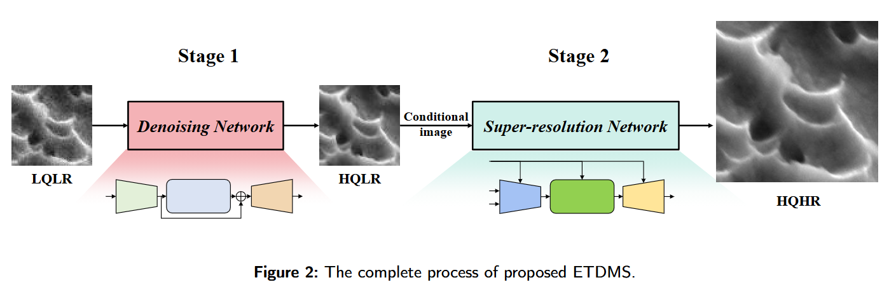
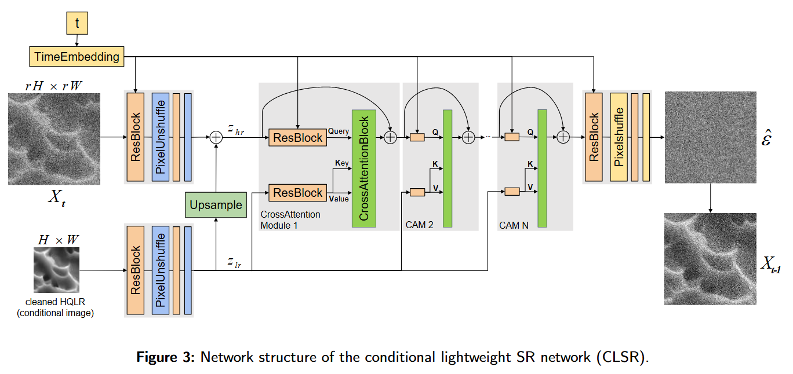
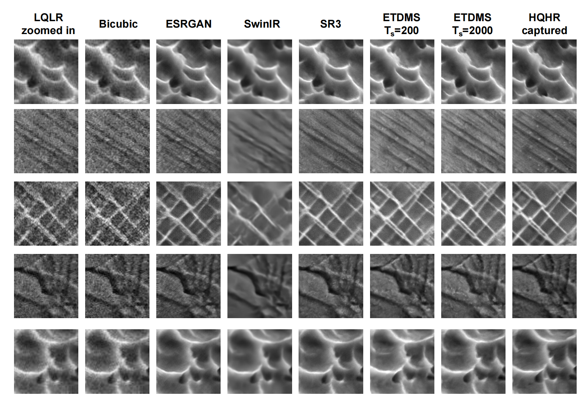

# ETDMS: Efficient Two-Stage Diffusion Model for Accelerated SEM Image Super-Resolution


## Introduction
ETDMS is a novel two-stage diffusion model specifically designed for scanning electron microscope (SEM) image super-resolution. The model efficiently combines denoising and super-resolution in a two-stage pipeline:


1. **Stage 1 (DN)**: SwinIR for image denoising (64×64 → 64×64)
2. **Stage 2 (CLSR)**: Conditional Lightweight Super-Resolution network for image super-resolution (64×64 → 256×256)




## Main Contributions

1. Proposed an efficient two-stage diffusion model specifically for SEM image super-resolution
2. First stage uses SwinIR for effective image denoising, improving image quality
3. Second stage uses a lightweight conditional diffusion model (CLSR) for super-resolution, significantly reducing computational complexity and inference time
4. Compared to existing methods, ETDMS significantly improves processing speed while maintaining image quality

## 🚀 Quick Start

## Environment Setup

```bash
pip install -r requirements.txt
```
### Dataset Preparation
Prepare your dataset following this structure:
```
ETDMS/
├── config/                    # Configuration files
│   ├── swinir_denoising.json
│   ├── clsr_superresolution.json
│   └── etdms_full.json
├── core/                      # Core utilities
│   ├── logger.py
│   ├── metrics.py
│   └── wandb_logger.py
├── data/                      # Data loading modules
│   ├── LRHR_dataset.py
│   └── util.py
├── model/                     # Model implementations
│   ├── swinir_model.py
│   ├── clsr_model.py
│   ├── swinir_modules/
│   └── clsr_modules/
├── dataset/                   # Dataset directory (create this)
├── experiments/               # Training outputs
├── train_etdms.py            # Training script
├── infer_etdms.py            # Inference script
├── run_metrics.py            # Evaluation script
└── README.md
```

### Training

    python train_etdms.py -c config/swinir_denoising.json -s 1 -gpu 0
    python train_etdms.py -c config/clsr_superresolution.json -s 2 -gpu 0
    python train_etdms.py -c config/etdms_full.json -s 0 -gpu 0

### Testing

    python infer_etdms.py -c config/etdms.json -i input_path -o output_path -gpu num

### Evaluation
Compute PSNR, SSIM, and FID metrics.

    python run_metrics.py project_name cuda_device

Please replace `project_name` with the complete name found in the experiments folder, and replace `cuda_device` with a numerical value.


### Performance Comparison

| Method | PSNR (↑) | SSIM (↑) | FID (↓) | LPIPS (↓) |
|--------|----------|----------|---------|----------|
| Bicubic | 21.73 | 0.420 | 188.87 | 0.5837 |
| ESRGAN | 22.41 | 0.524 | 57.676 | 0.617 |
| SwinIR | 24.21 | 0.675 | 157.58 | 0.5872 |
| SR3 | 23.85 | 0.607 | 41.25 | 0.2143 |
| ETDMS (Ts=200) | 22.54 | 0.652 | 42.79 | 0.1960 |
| **ETDMS (Ts=2000)** | **24.96** | **0.643** | **39.03** | **0.1760** |

*Higher PSNR and SSIM values indicate better quality. Lower FID and LPIPS values indicate better perceptual quality.*

### Computational Complexity Comparison

| Method | Parameters (M) | FLOPs (G) | Inference Time (s) |
|--------|----------------|-----------|-------------------|
| ESRGAN | 16.735 | 90.680 | 0.0249 |
| SwinIR | 11.852 | 50.546 | 0.0723 |
| SR3 | 92.514 | 177.993 | 25.0039 |
| **ETDMS** | **11.583** | **56.700** | **0.894** |

*ETDMS achieves competitive performance with significantly reduced inference time compared to SR3.*

### Visual Results




------
## 📚 Citation
If you find this work useful in your research, please consider citing:
```
@article{ETDMS2025,
  title={ETDMS: Efficient Two-stage Diffusion Model for SEM Image Super-Resolution},
  author={Xuecheng Zhang, Zixin Li, Bin Zhang},
  note={Submitted to Ultramicroscopy},
  year={2025}
}
```

### References

 1. [SwinIR](https://github.com/JingyunLiang/SwinIR)
 2. [KAIR](https://github.com/cszn/KAIR)
 3. [LWTDM](https://github.com/Suanmd/LWTDM)
